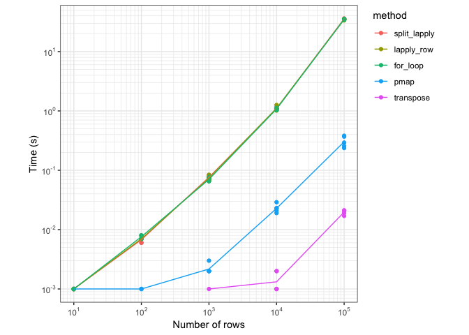
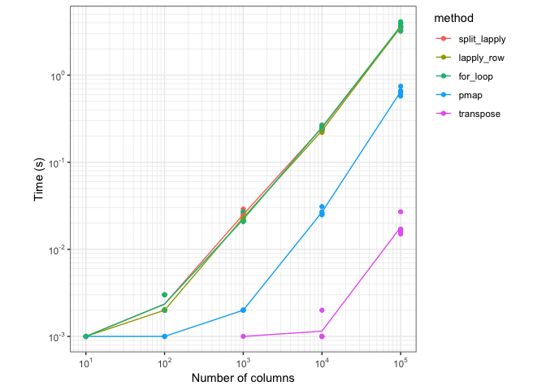

Turn data frame into a list, one component per row
================
Jenny Bryan, updating work of Winston Chang
2018-09-05

Update of <https://rpubs.com/wch/200398>.

  - Added some methods, removed some methods.
  - Run every combination of problem size & method multiple times.
  - Explore different number of rows and columns, with mixed col types.

<!-- end list -->

``` r
library(scales)
library(tidyverse)
```

    ## ── Attaching packages ──────────────────────────────────── tidyverse 1.2.1 ──

    ## ✔ ggplot2 3.0.0     ✔ purrr   0.2.5
    ## ✔ tibble  1.4.2     ✔ dplyr   0.7.6
    ## ✔ tidyr   0.8.1     ✔ stringr 1.3.1
    ## ✔ readr   1.2.0     ✔ forcats 0.3.0

    ## ── Conflicts ─────────────────────────────────────── tidyverse_conflicts() ──
    ## ✖ readr::col_factor() masks scales::col_factor()
    ## ✖ purrr::discard()    masks scales::discard()
    ## ✖ dplyr::filter()     masks stats::filter()
    ## ✖ dplyr::lag()        masks stats::lag()

``` r
# for loop over row index
f_for_loop <- function(df) {
  out <- vector(mode = "list", length = nrow(df))
  for (i in seq_along(out)) {
    out[[i]] <- as.list(df[i, , drop = FALSE])
  }
  out
}

# split into single row data frames then + lapply
f_split_lapply <- function(df) {
  df <- split(df, seq_len(nrow(df)))
  lapply(df, function(row) as.list(row))
}

# lapply over the vector of row numbers
f_lapply_row <- function(df) {
  lapply(seq_len(nrow(df)), function(i) as.list(df[i, , drop = FALSE]))
}

# purrr::pmap
f_pmap <- function(df) {
  pmap(df, list)
}

# purrr::transpose (happens to be exactly what's needed here)
f_transpose <- function(df) {
  transpose(df)
}

## explicit gc, then execute `expr` `n` times w/o explicit gc, return timings
benchmark <- function(n = 1, expr, envir = parent.frame()) {
  expr <- substitute(expr)
  gc()
  map(seq_len(n), ~ system.time(eval(expr, envir), gcFirst = FALSE))
}

run_row_benchmark <- function(nrow, times = 5) {
  df <- data.frame(
    x = rep_len(letters, length.out = nrow),
    y = runif(nrow),
    z = seq_len(nrow)
  )
  res <- list(
    transpose     = benchmark(times, f_transpose(df)),
    pmap          = benchmark(times, f_pmap(df)),
    split_lapply  = benchmark(times, f_split_lapply(df)),
    lapply_row    = benchmark(times, f_lapply_row(df)),
    for_loop      = benchmark(times, f_for_loop(df))
  )
  res <- map(res, ~ map_dbl(.x, "elapsed"))
  tibble(
    nrow = nrow,
    method = rep(names(res), lengths(res)),
    time = flatten_dbl(res)
  )
}

run_col_benchmark <- function(ncol, times = 5) {
  nrow <- 3
  template <- data.frame(
    x = letters[seq_len(nrow)],
    y = runif(nrow),
    z = seq_len(nrow)
  )
  df <- template[rep_len(seq_len(ncol(template)), length.out = ncol)]
  res <- list(
    transpose     = benchmark(times, f_transpose(df)),
    pmap          = benchmark(times, f_pmap(df)),
    split_lapply  = benchmark(times, f_split_lapply(df)),
    lapply_row    = benchmark(times, f_lapply_row(df)),
    for_loop      = benchmark(times, f_for_loop(df))
  )
  res <- map(res, ~ map_dbl(.x, "elapsed"))
  tibble(
    ncol = ncol,
    method = rep(names(res), lengths(res)),
    time = flatten_dbl(res)
  )
}

## force figs to present methods in order of time
flevels <- function(df) {
  mutate(df, method = fct_reorder(method, .x = desc(time)))
}

plot_it <- function(df, what = "nrow") {
  log10_breaks <- trans_breaks("log10", function(x) 10 ^ x)
  log10_mbreaks <- function(x) {
    limits <- c(floor(log10(x[1])), ceiling(log10(x[2])))
    breaks <- 10 ^ seq(limits[1], limits[2])

    unlist(lapply(breaks, function(x) x * seq(0.1, 0.9, by = 0.1)))
  }
  log10_labels <- trans_format("log10", math_format(10 ^ .x))

  ggplot(
    df %>% dplyr::filter(time > 0),
    aes_string(x = what, y = "time", colour = "method")
    ) +
    geom_point() +
    stat_summary(aes(group = method), fun.y = mean, geom = "line") +
    scale_y_log10(
      breaks = log10_breaks, labels = log10_labels, minor_breaks = log10_mbreaks
    ) +
    scale_x_log10(
      breaks = log10_breaks, labels = log10_labels, minor_breaks = log10_mbreaks
    ) +
    labs(
      x = paste0("Number of ", if (what == "nrow") "rows" else "columns"),
      y = "Time (s)"
    ) +
    theme_bw() +
    theme(aspect.ratio = 1, legend.justification = "top")
}

## dry runs
# df_test <- run_row_benchmark(nrow = 10000) %>% flevels()
# df_test <- run_col_benchmark(ncol = 10000) %>% flevels()
# ggplot(df_test, aes(x = method, y = time)) +
#   geom_jitter(width = 0.25, height = 0) +
#   scale_y_log10()

## The Real Thing
## fairly fast up to 10^4, go get a coffee at 10^5 (row case only)
#df_r <- map_df(10 ^ (1:5), run_row_benchmark) %>% flevels()
#write_csv(df_r, "row-benchmark.csv")
df_r <- read_csv("row-benchmark.csv") %>% flevels()
```

    ## Parsed with column specification:
    ## cols(
    ##   nrow = col_double(),
    ##   method = col_character(),
    ##   time = col_double()
    ## )

``` r
plot_it(df_r, "nrow")
```

<!-- -->

``` r
#ggsave("row-benchmark.png")

#df_c <- map_df(10 ^ (1:5), run_col_benchmark) %>% flevels()
#write_csv(df_c, "col-benchmark.csv")
df_c <- read_csv("col-benchmark.csv") %>% flevels()
```

    ## Parsed with column specification:
    ## cols(
    ##   ncol = col_double(),
    ##   method = col_character(),
    ##   time = col_double()
    ## )

``` r
plot_it(df_c, "ncol")
```

<!-- -->

``` r
#ggsave("col-benchmark.png")

## used at first, but saw same dramatic gc artefacts as described here
## in my plots
## https://radfordneal.wordpress.com/2014/02/02/inaccurate-results-from-microbenchmark/
## went for a DIY solution where I control gc
# library(microbenchmark)
# run_row_microbenchmark <- function(nrow, times = 5) {
#   df <- data.frame(x = rnorm(nrow), y = runif(nrow), z = runif(nrow))
#   microbenchmark(
#     for_loop      = f_for_loop(df),
#     split_lapply  = f_split_lapply(df),
#     lapply_row    = f_lapply_row(df),
#     pmap          = f_pmap(df),
#     transpose     = f_transpose(df),
#     times = times
#   ) %>%
#     as_tibble() %>%
#     rename(method = expr) %>%
#     mutate(method = as.character(method)) %>%
#     add_column(nrow = nrow, .before = 1)
# }
```
